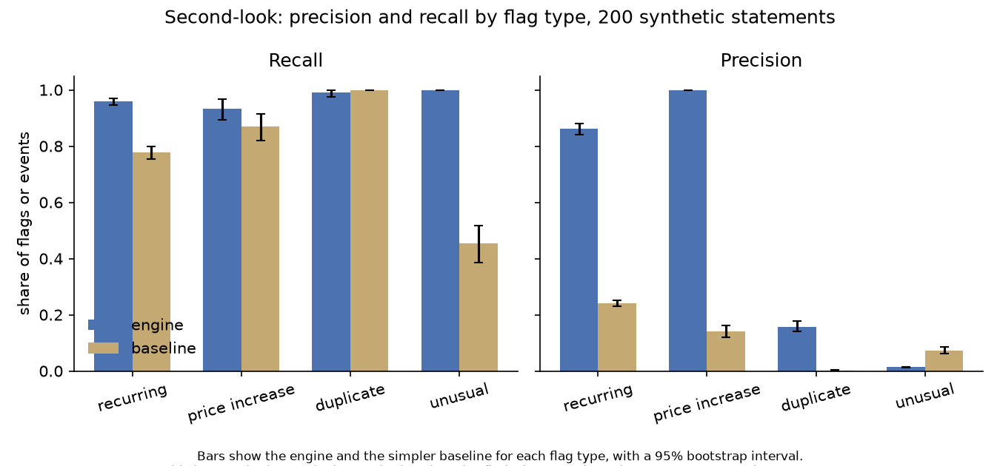
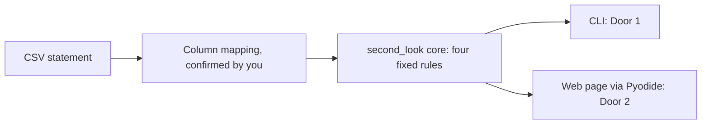

# second-look

Finds recurring charges, price rises, duplicates and odd spending in your browser

## In plain words

second-look reads a bank or card statement and finds charges worth a second look. It
flags things like a subscription, a price rise, a possible double charge, or a charge
that looks unusual for you. You tell it which column holds the date, the description
and the amount, and it explains each flag in one plain sentence, on your own computer
or right inside your browser.

## Try it

Live, in your browser, nothing uploaded:
[iliya-valizadeh.github.io/second-look](https://iliya-valizadeh.github.io/second-look/)

Or the command line:

```bash
git clone https://github.com/Iliya-Valizadeh/second-look.git && cd second-look
make setup
make demo
```

`make demo` needs no downloads and no keys. It runs the command line on a small,
hand-written, made-up statement and prints the flags it finds. For your own statement,
see [the tutorial](docs/tutorial.md) or
[how to map a new bank's columns](docs/how-to/map-a-banks-csv-columns.md).

Every run ends with the same note:

> This tool points out charges you may want to look at again. It is not financial
> advice. It cannot tell whether a charge is right or wrong. Only you, the merchant or
> your bank can.

## Result

On 200 synthetic statements, second-look found 0.9588 of the planted fixed-amount
recurring charges, its [recall](docs/glossary.md#recall) (a 95%
[confidence interval](docs/glossary.md#confidence-interval) of 0.9467 to 0.9695), and
0.861 of its recurring flags were right, its [precision](docs/glossary.md#precision)
(0.8408 to 0.8802). A simple [baseline](docs/glossary.md#baseline) that just groups
same-merchant, same-amount charges found 0.7772 recall at 0.2414 precision. This is
probably the easiest of the four flag types, because the script plants these series at
regular gaps on purpose. Every number here comes from statements a script made up,
with events the same script planted, never from a real bank statement. The same person
wrote that script and the rules, so the test may suit the rules. It does not show how
well the tool works on real statements.

The tool did not pass the bar set before any result. The plan judges it on the first
test run, and that run failed five checks, such as duplicate precision of 0.1577
against a bar of 0.50. Two fixes followed
([ADR 0006](docs/decisions/0006-typical-charge-for-simple-unusual-rules.md),
[ADR 0007](docs/decisions/0007-habit-test-for-duplicates.md)). After them, two checks
still fail. Recurring precision needed to reach 0.90; it reached 0.861. Unusual-charge
precision needed to reach 0.50; it rose from 0.0136 to 0.4589 (0.4263 to 0.4916).
[docs/whats_weak.md](docs/whats_weak.md) and
[reports/error_analysis.md](reports/error_analysis.md) explain why, and what was tried.



Each bar is one flag type's precision or recall, second-look next to its baseline, with
the interval marked. Recurring and unusual precision are the two engine bars that fall
short of their own line; duplicate and price increase clear theirs by a wide margin.

## How I worked

- Evaluation plan, committed before any evaluation code or result:
  [docs/eval_plan.md](docs/eval_plan.md) (commit `ccd8042`).
- Decision records: [docs/decisions/](docs/decisions/), including the two real fixes
  made after the first evaluation run,
  [ADR 0006](docs/decisions/0006-typical-charge-for-simple-unusual-rules.md) and
  [ADR 0007](docs/decisions/0007-habit-test-for-duplicates.md).
- Error analysis, sorting every wrong flag and miss by cause:
  [reports/error_analysis.md](reports/error_analysis.md).
- How ready this is for production, scored against Breck et al.'s checklist:
  [docs/ml_test_score.md](docs/ml_test_score.md).
- How the AI assistant was used: [AI_USAGE.md](AI_USAGE.md).

## How it works



One core package holds all four detection rules and touches no file, clock or network
([ADR 0001](docs/decisions/0001-one-engine-two-doors.md)). Two doors call the same
functions: a command line for technical users, and a web page that runs the core in
your browser through [Pyodide](docs/glossary.md#pyodide), so a statement never has to
leave your device ([ADR 0004](docs/decisions/0004-web-door-pyodide-and-csp.md)). No
bank format is guessed; you confirm the column mapping before anything runs
([ADR 0003](docs/decisions/0003-importing-statements.md)). Every number a rule uses is
a named constant with a written reason, not learned from data
([ADR 0002](docs/decisions/0002-detection-rules-and-thresholds.md)). The tool avoids
words that suggest a crime ([ADR 0005](docs/decisions/0005-privacy-and-wording.md)).
The web page's policy blocks requests to any other address, and a browser test in CI
checks one full run on the demo statement for any stray request (ADR 0004).

## What's weak

The full, ranked list is in [docs/whats_weak.md](docs/whats_weak.md). What matters most:

- Every number above comes from statements a script made up, with events the same
  script planted. A stress test hints at the cost: with a little more posting delay and
  currency noise, recurring recall falls from 0.9588 to 0.5959.
- Unusual-charge precision, 0.4589, is still below its own bar of 0.50, even after the
  real fix in ADR 0006.
- Recurring-charge precision, 0.861, is below its own bar of 0.90.
  [reports/error_analysis.md](reports/error_analysis.md) traces most of the wrong flags
  to two ordinary shop charges that land about a year apart by chance.
- Some patterns are missed with no message. The tool found 3 of the 200 planted bills
  whose amount changes each month. It missed 14 of the 206 planted price increases,
  each time because a one-off extra charge came before the new price.
- If you choose the wrong sign for amounts, every charge is read as money coming in.
  The tool then says there is nothing worth a second look, with no warning.

## Docs

- Tutorial: [docs/tutorial.md](docs/tutorial.md)
- How-to guides: [docs/how-to/](docs/how-to/)
- Reference: [docs/reference.md](docs/reference.md)
- Explanation: [docs/explanation.md](docs/explanation.md)
- Glossary: [docs/glossary.md](docs/glossary.md)
- Datasheet: [DATASHEET.md](DATASHEET.md)
- Changes: [CHANGELOG.md](CHANGELOG.md)

## Repo map

<!-- repo-map:start -->
| Path | What it holds |
|---|---|
| `.github/` | CI workflows and GitHub settings |
| `CLAIMS.md` | Every number in the docs, with its source file and command |
| `docs/` | Evaluation plan, decisions, glossary and the four kinds of docs |
| `evaluation/` | The synthetic statement generator, baselines and evaluation script |
| `Makefile` | One command for each step: setup, lint, test, eval, demo |
| `reports/` | Generated results, including metrics.json |
| `src/` | The package code |
| `tests/` | Unit and data tests |
| `tools/` | Checks for claims, readability, AI-writing signs and links |
| `web/` | The web door: the same package running in the browser through Pyodide |
<!-- repo-map:end -->

## License

MIT. See [LICENSE](LICENSE).
