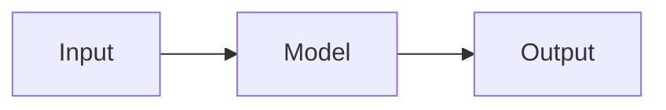

# second-look

Finds recurring charges, price rises, duplicates and odd spending in your browser

## In plain words

TODO: three short sentences that a person with no technical background can follow.
Say what goes in, what comes out, and why someone would care.

## Try it

TODO: a live link if one exists. Otherwise these three commands:

```bash
make setup
make demo
make all
```

`make demo` needs no downloads and no keys.

## Result

TODO: one number with its [confidence interval](docs/glossary.md#confidence-interval),
compared against a simple [baseline](docs/glossary.md#baseline). Every number here
needs a row in [CLAIMS.md](CLAIMS.md) that points to `reports/metrics.json`.

TODO: one chart, with a caption that says what to notice.

## How I worked

- Evaluation plan, written before any results: [docs/eval_plan.md](docs/eval_plan.md)
  (TODO: the commit hash that added it).
- Decision records: [docs/decisions/](docs/decisions/).
- Error analysis: TODO: link.
- How ready it is for production, scored against Breck et al.'s checklist:
  [docs/ml_test_score.md](docs/ml_test_score.md).
- How the AI assistant was used: [AI_USAGE.md](AI_USAGE.md).

## How it works



TODO: five lines of text that explain the diagram.

## What's weak

TODO: the main weaknesses, ranked by how much each could change the result.
The full list is in [docs/whats_weak.md](docs/whats_weak.md).

## Docs

- Tutorial: [docs/tutorial.md](docs/tutorial.md)
- How-to guides: [docs/how-to/](docs/how-to/)
- Reference: [docs/reference.md](docs/reference.md)
- Explanation: [docs/explanation.md](docs/explanation.md)
- Glossary: [docs/glossary.md](docs/glossary.md)
- Datasheet: [DATASHEET.md](DATASHEET.md)
- Changes: [CHANGELOG.md](CHANGELOG.md)

## Repo map

<!-- repo-map:start -->
| Path | What it holds |
|---|---|
| `.github/` | CI workflows and GitHub settings |
| `CLAIMS.md` | Every number in the docs, with its source file and command |
| `docs/` | Evaluation plan, decisions, glossary and the four kinds of docs |
| `evaluation/` | The synthetic statement generator, baselines and evaluation script |
| `Makefile` | One command for each step: setup, lint, test, eval, demo |
| `reports/` | Generated results, including metrics.json |
| `src/` | The package code |
| `tests/` | Unit and data tests |
| `tools/` | Checks for claims, readability, AI-writing signs and links |
| `web/` | The web door: the same package running in the browser through Pyodide |
<!-- repo-map:end -->

## License

MIT. See [LICENSE](LICENSE).
